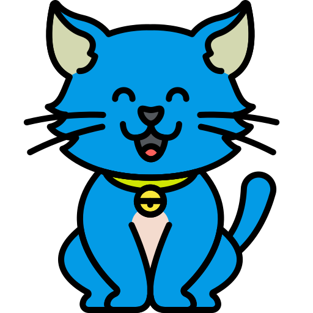

#  Ditty
Decentralized kitty parties aka chit funds application build on Solana blockchain

A Decentralized kitty application built on Solana blockchain is a type of financial application that allows users to create and manage kitty parties in a trustless and secure manner. Chit funds are a type of informal savings scheme that is popular in many developing countries. In a chit fund, each member contributes a fixed amount of money on a regular basis. The total amount of money collected is then distributed to one member of the group, who is selected through a auction.

## Apart from Transparency & Security some of the benefits of using Ditty app

**Enhancing Borrower Accountability:**
Lending money to a close friend can be a daunting prospect, as it often leads to uncertainty regarding repayment. However, with a ditty, the borrowing process becomes more accountable. This accountability stems from involving multiple individuals who are intimately acquainted with the borrower, making it more likely that borrowed funds will be returned as agreed upon.

**Blockchain Adoption for Kitty Parties:**
As kitty parties are typically informal gatherings among close-knit social circles, often bypassing the need for regulatory compliance or Know Your Customer (KYC) requirements, the potential for blockchain adoption is particularly promising. This is especially true in an era where virtual interactions are gaining preference over in-person gatherings, making blockchain-based solutions like ditty even more appealing.

**Lower Costs:**
Running a kitty parties on a blockchain can reduce operational costs associated with paperwork, physical meetings, and administrative overhead. This can result in lower fees for participants and higher returns on investments.

**Decentralization:**
Decentralization eliminates the need for a central authority to oversee the kitty party. Instead, consensus rules and smart contracts govern the fund, making it resistant to manipulation or corruption.

**Immutable Records:**
All transactions and agreements on the Solana blockchain are immutable, meaning they cannot be altered or deleted once recorded. This feature ensures that records of kitty parties activities are secure and tamper-proof.

Here is a simple example of how a decentralized kitty application could work:
1) A user creates a new chit fund on the blockchain.
2) Users can join by contributing a fixed amount regularly.
3) The total amount of money collected is then distributed to one member of the group, who is selected through a auction.
4) The process is repeated until all of the members of the group have received a payout.
   
## Usecases
Here are some specific examples of how decentralized kitty app on Solana blockchain could be used:
- A group of friends could use it to save money for a down payment on a house.
- A group of small businesses could use it to crowdfund the purchase of new equipment.
- A group of farmers could use it fund to provide each other with microfinance loans.
- A group of people could use it to start a savings club to save money for their retirement.

Ditty have the potential to make financial services more accessible and inclusive for everyone.

## Testing Instructions

1. **Access the Application**: Open the following link in your web browser: [ChitFund Application](https://ditty-sol.vercel.app/).

2. **Connect Your Phantom Wallet**: To interact with the application on the Solana Devnet, you'll need to connect your Phantom wallet. Make sure you have Phantom wallet installed and set up in your browser.

3. **Create a ChitFund**: In the application, navigate to the "Create" section. Enter the name (without spaces), description and the mpnthly committed amount per participant for the chit fund you want to create. This will generate a unique link for your chit fund.

4. **Invite Participants**: Share the unique link generated in step 3 with other participants (currently the chitfund only supports 3 participants and organizer will be the default 1st participant). The other participants can join your chit fund using the unique link.

5. **Monthly Bidding Process**: After all the participants have joined, the monthly bidding process will start automatically. The participants who is in need of urgent cash will try to bid as low as possible.

6. **Determine the Winner**: After the bidding process, the participant with the lowest bid will win the bidding for that month.

7. **Fund Distribution**: All other participants will deposit their share into the ChitFund PDA account, and the funds will be distributed to the bid winner.

8. **Repeat**: The same cycle will continue for the next month, with a new round of bidding and fund distribution.

**Note:** Please ensure that you're using the application on the Solana Devnet and have the Phantom wallet connected for testing.

## Revenue Model 

**1$ Creation Fee:** For every chit fund account that is created the dapp can charge a fixed fee of 1$ 

**Advertising:** The dApp could sell advertising space to businesses that want to reach its users. This would be a relatively low-effort way to generate revenue, but it is important to ensure that the ads are relevant to the dApp's users and do not disrupt their experience.

In addition to the above revenue models, decentralized chit fund dApps could also explore new and innovative ways to generate revenue. For example, we could use blockchain technology to create new types of financial products and services. We could also partner with other businesses to offer integrated services.

If you'd like to contribute to this project or report any issues, please visit our [GitHub repository](https://github.com/lokeshwaran100/ditty).
